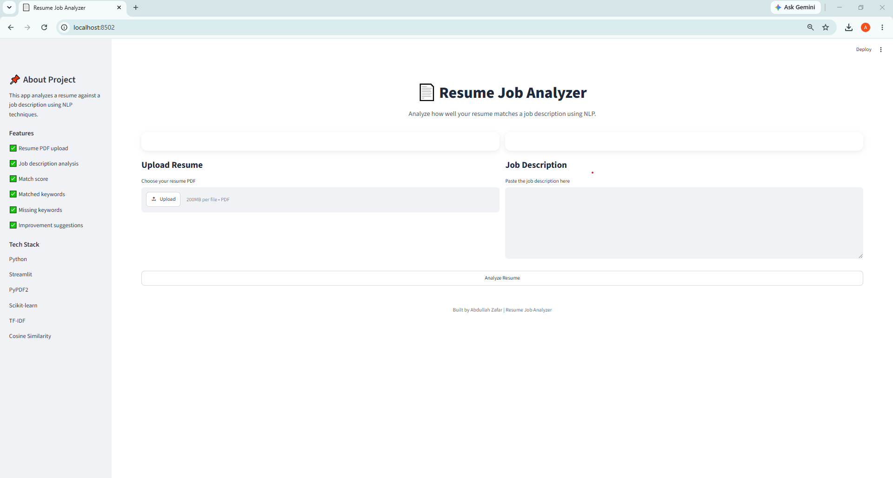
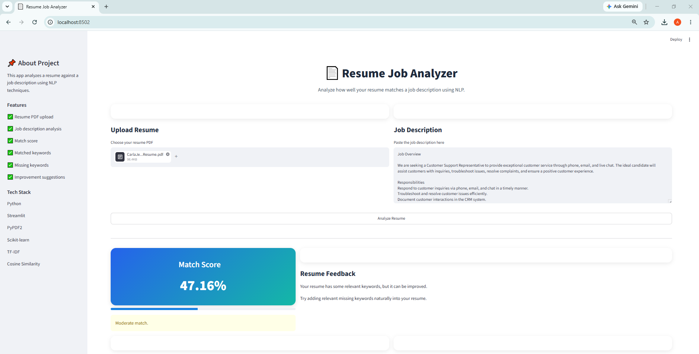

# Resume Job Analyzer

A Streamlit application that compares a resume with a job description using NLP techniques.

## Features

- Upload Resume PDF
- Paste Job Description
- Match Score Calculation
- Matched Keywords
- Missing Keywords
- Resume Improvement Suggestions

## Technologies Used

- Python
- Streamlit
- PyPDF2
- Scikit-Learn
- TF-IDF
- Cosine Similarity

## Installation

```bash
pip install -r requirements.txt
streamlit run app.py
```

## Screenshots

### Home Page



### Analysis Result



## Author

Abdullah Zafar